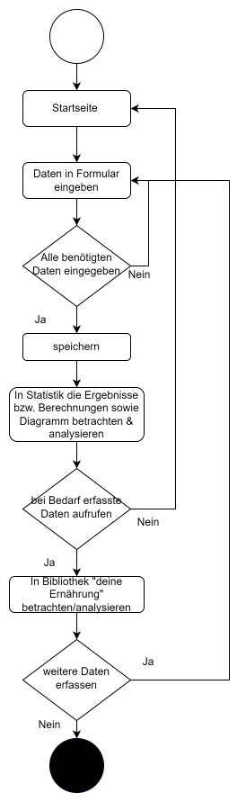

# Snack'o Maker 

# Idee dahinter

Snack'o Maker; fragt einen auf der Startseite, welchen Snack oder Menu man zu sich genommen hat.
Das ganze soll durch den User via Formular erfasst werden.(Snack/Menu, Kalorien sowie die Kosten und das Datum)
Nach absenden der Daten, sollen diese in einer Datenbank gespeichert werden und ebenfalls unter der Rubrik "deine Ernährung" ersichtlich sein. 
Zeitgleich soll eine Statistik gezogen werden, welche darstellt, wieviele Snacks/Menus man zu sich genommen, wie teuer diese im Total waren und wie viele Kalorien
man zu sich genommen hat. Die anzahl Kalorien soll dann, mittels Vergleich zur eigen erstellten Tabelle, aufschluss geben, ob man sich im "gesunden Rahmen" bezüglich der Kalorieneinnahme befindet oder nicht.
Eine Plotly Grafik soll dies noch grafisch darstellen.

# Problembeschreibung/Motivation
**Warum dieses Projekt**
- Dieses Projekt wurde gewählt, da Ernährung eine immer wichtigere Rolle spielt und man oft vergisst, wie ungesund 
man sich ernährt. Sei dies bewusst oder unbewusst. Es gibt sehr viele Lebensmittel, welche auf den ersten Blick gesund wirken, es aber ich wirklickkeit 
nicht sind. 
- Ebenfalls gibt man (ich) oft sehr viel Geld für Essen aus. Sei es ein Restaurantbesuch mit Kollegen, oder weil man etwas feines Kochen will oder einfach nur um die Lust auf gewisse Snacks zu befriedigen.
- Auch kann es der Fall sein, dass man zu viele / zu wenige Kalorien zu sich nimmt, ebenfalls kann dies bewusst der Fall sein, kann aber auch schnell mal unbewusst passieren. 
Nimmt man nämlich zuviele Kalorien zu sich, ohne dass der Körper die grosse Anzahl benötigt, nimmt man an Körpergewicht zu. Nimmt man zu wenig zu sich, nimmt man logischerweise ab.

Snack'o Maker soll am Schluss aufzeigen, wie viele Menus oder Snacks man zu sich genommen hat, wie viele Kalorien dies sind und effektiv zu sich genommen wurden und dies in Kombination mit den tatsächlichen Ausgaben die man hatte.
Anhand dieser Informationen, kann man als grober Richtwert entnehmen, ob man sich gesund ernährt (Anhand der Kalorien, die man zu sich genommen hat) und wo man vielleicht noch Sparpotenzial hat (Anhand der totalausgaben). Ab Ausgaben von 
CHF 500.00 soll das System einen darauf aufmerksam machen, dass man die Ausgaben im Überblick behalten soll.

**Welches Problem löst das Projekt**
- Anhand der eingenommenen Kalorien soll Rückschlüsse gezogen werden, ob man sich in etwa Gesund ernährt oder nicht. Eine eigen erstellte Tabelle soll als Richtwert dazu dienen.
- Ebenfalls werden die Ausgaben dazu erfasst und können darüber Rückschluss geben, wieviel Ausgaben man tatsächlich für Snacks und Menüs hat.

**Was macht das Projekt**
- Berechnet die Total zu sich genommenen Snacks und Menus.
- Berechnet die Totalten Ausgaben, die man für Menus und Snacks hatte.
- Berechnet die total eingenommenen Kalorien, die man durch die Menu/Snacks zu sich genommen hat.
- Wiederspiegelt diese Daten in einer Funnelgrafik im Verhältnis wieder.

# Betrieb
**Betrieb**

Snack'o maker ist so aufgebaut, dass man auf der Startseite "Home" direkt die Inputseite hat, bei der
man sein Snack / Menu erfassen kann. Um eingenommene Mahlzeit (Snack / Menu) zu erfassen, füllt man alle Felder "Menu/Snack",
"Kalorien", "Preis CHF" sowie das "Datum" aus.
Sind all diese Daten erfasst, können diese durch den "Button" speichern, gespeichert werden.
Eine Flashmessage "Besten Dank für deine Eingabe, deine Daten wurden ordnungsgemäss gespeichert." erscheint und die eingegebenen Daten
werden in einem Json-File gespeichert. Die Daten des Json-Files werden ebenfalls unter "deine Ernährung" wiedergespiegelt. 

Unter "deine Ernährung" sind alle gespeicherten Daten ersichtlich. Sprich "Menu/Snack", "Kalorien", "Preis CHF" sowie "Datum".

Die Statistic - Zusammenfassung, zeigt einem wieviele Menu und Snacks man zu sich genommen hat, wie viel diese im Totalen gekostet haben und
die Kalorien, die man zu sich genommen hat. Anahnd der eigenerstellten Tabelle, welche Orientierungswerte im Bezug zur Kalorieneinhame darstellt, kann man Rückschlüsse ziehen,
ob man sich eher gesund oder weniger gesund ernährt. Auch sieht man auf einem Blick wie viel Geld man für
Knabberein und Gerichte ausgibt. 

Die Statistic - Grafik, wiederspiegelt eine Funnelgrafik, welche die Anzahl der zu sich genommenen Snacks/Menus im Verhältnis zu den Ausgaben und Kalorien darstellt.

**Welche zusätzliche Pakete müssen bei Bedarf installiert werden.**
- Flask/Jinja2 (logisch) sowie flash für Flashmessages
- Plotly und Pandas für Grafik
- Django Bootstrap für Bootstrap 

**Funktionen**

- **Home:** Stellt die Index-Seite dar. Auf dieser werden ebenfalls alle Daten via Formular erfasst. Nachdem
betätigen des "speichern" Buttons, erscheint eine Flashmeldung und der Eintrag wird in dem Json-File ernährung_zusammengefasst.json
gespeichert.
- **deine Ernährung:** deine Ernährung wiederspiegelt die menu.html Seite. Dort werden die Daten des Json-Files verarbeitet und in einer Liste wiedergegeben.
- **Statistic - Zusammenfassung:** In der Zusammenfassung findet man Daten, welche anhand des Json-Files berechnet wurden.
- **Statistic - Grafik:** Anhand der berechneten Daten wird mit Plotly die Grafik, sprich ein Funnel in einem separatem Fenster dargestellt.

# Benutzung
**Wie wird das Projekt benutzt**
1. Menus, sprich ernährung wird erfasst inkl. Preis, Kalorien, sowie Datum. 
2. Dies wiederholt sich bis -
3. Man in die Statistik - Zusammenfassung geht, um dort die Zusammenfassung zu sehen. Dort ersichtlich sind die totalen Ausgaben, die total eingenommenen Kalorien sowie die total erfassten Menus/Snacks.
Ebenfalls besteht die Möglichkeit unter Statistik - Grafik, die Funnelgrafik, der berechneten Daten der "Zusammenfassung" Visuell zu betrachten.
4. Nach belieben können immer weitere Menu/Snacks erfasst werden.
5. Die erfassten Daten sind gleichzeitig in der Bibliothek "deine Ernährung" ersichtlich, falls man etwas nachschauen möchte.

# Architektur/Flowdiagram
**Hier bei Bedarf eine kurze Beschreibung des Ablaufs des Programms auf Code Ebene z.B. als Ablaufdiagramm.**

# Ungelöste/unbearbeitete Probleme
**Was wurde nicht gelöst**

Ich wollte eine Suchfunktion unter "deine Ernährung" einbauen. Das Inputfeld funktionierte Einwandfrei, entgegengenommen wurde die Eingabe auch. Doch den Eintrag
hatte es nie gefunden. Nach langem rumpröblen und verzweifeln, entschliess ich mich dazu, diesen Part mit der Suchfunktion wegzulassen.

**Welche Verbesserungen könnten noch gemacht werden.**
- Zurücksetzt-Button der Daten, damit man diese nicht im json-file löschen gehen muss.
- Suchfunktion in "deine Ernährung".
- Ebenfalls Getränke einbinden, nebst den Snacks.. Da Süssgetränke enorm viel kalorien enthalten.
- Profil anlegen, welches am Schluss anhand der Profilangaben genau angibt wie Gesund man sich ernährt.